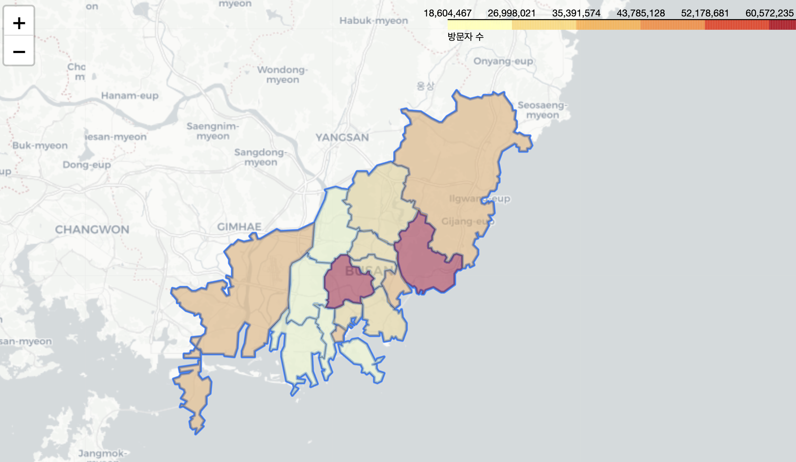

#  :bar_chart: Visualization 데이터 시각화 리포트

## 주제
- 코로나 이후 달라진 부산의 관광 변화
  - 코로나 이후 해외 여행의 금지로 인해 부산 국내 여행 소비자 증가할 것이다.

### 데이터 출처 
- 한국관광 데이터랩 (https://datalab.visitkorea.or.kr/datalab/portal/main/getMainForm.do)

### 데이터 정보
- 외국인 / 내국인 카드 소비 데이터
  -   기준년월
  -   광역지자체
  -   중분류
  -   지출액
  -   전년도 지출액

- 외국인 / 내국인 kt 통신 데이터
  - 기준년월
  - 기초지자체
  - 방문자 구분
  - 방문자 수
  - 전년도 방문자 수

- 부산광역시 주민등록인구통계
  - 구군
  - 동수(개소)
  - 세대수(세대)
  - 인구수(명)
  - 남자인구수(명)
  - 여자인구수(명)
  - 시전체 인구에 대한 구성비(퍼센트)
  - 면적(제곱킬로미터)
  - 인구밀도(제곱킬로미터 당 명수)

## 가설
- 가설1 : 부산의 구별 방문자수, 카드 소비 지출액, 인구 밀도는 연관성을 가진다.
- 가설 2-1: 코로나 이후 한국인(내지인)의 부산 관광 비중이 코로나 전보다 증가 하였을 것이다.
- 가설 2-2: 외국인의 비율은 감소하고 점점 증가하는 추세를 보일 것이다
- 가설 3:  내국인/ 외국인에 따라서 관광 소비 경향은 다를 것이다.
- 코로나 이후 더 증가한 소비 항목은 없을까?
- 가설 4: 코로나 이후 보복 소비로 인해 증가한 소비 항목들이 존재한다.
- 가설5 : 기장군의 롯데월드 개장으로 인해 관광 유원시설이 증가할 것이다.

## 데이터 시각화 결과 예시
- 모든 시각화 결과는 [Busan Data Journey](https://pepper-origami-952.notion.site/Busan-Data-Journey-ab7977d611ec4f25955f1ad6af337a3e?pvs=4) 에서 확인 가능합니다.
### 예시

